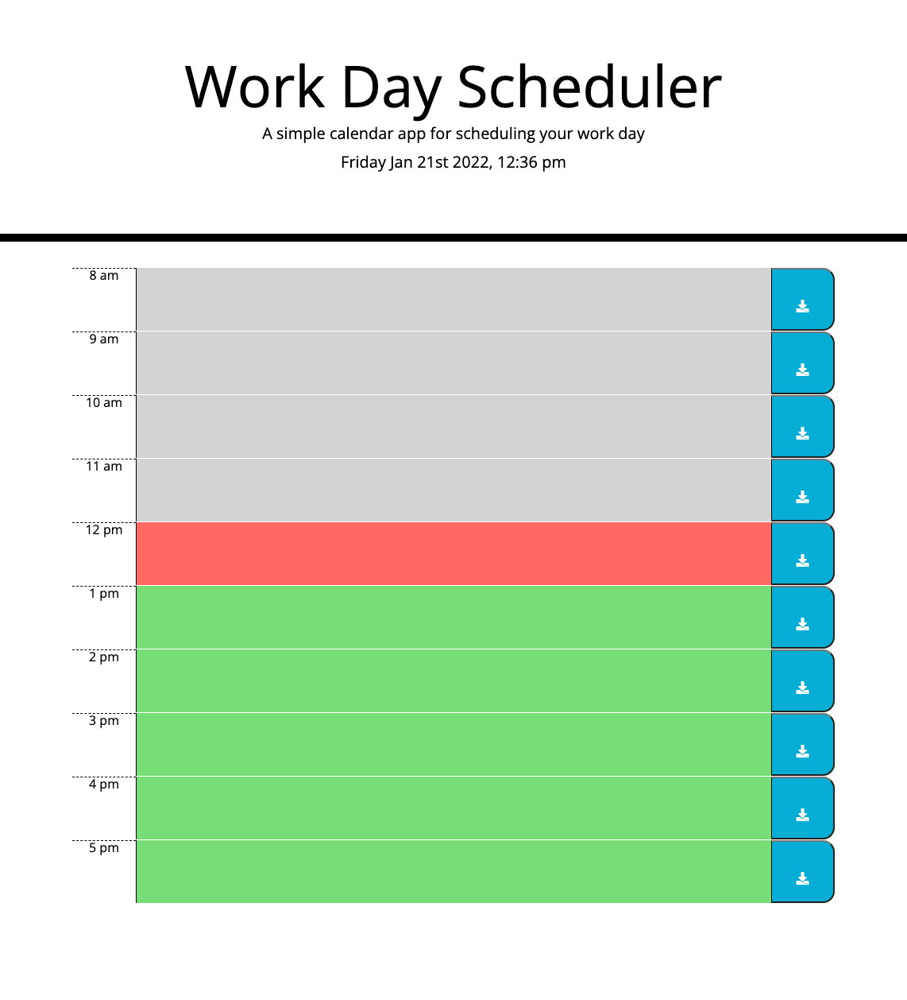
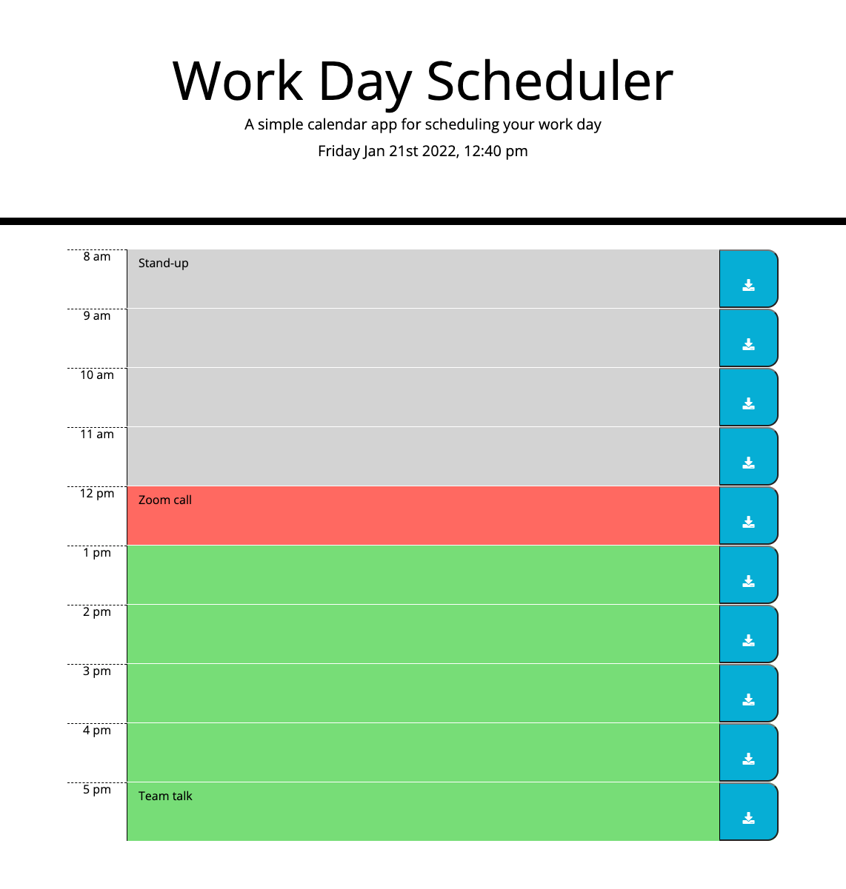
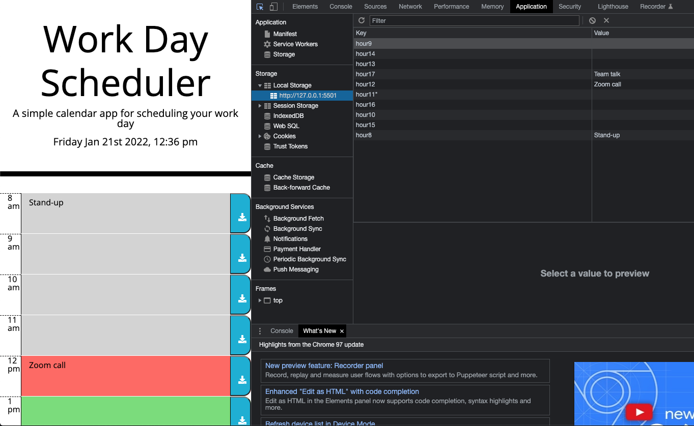

# Work Day Schuduler

## Description

I have been tasked to modify starter code to create a day planner application that allows the user to input events through the standard working day. The user must also be able to clearly see a colour coded application indicating the past, present and future parts of their day. I must include the date at the top of the page and allow the user to input save and retrieve their saved events upon refreshing the page.

## Acceptance Criteria - Checklist

- When the user opens the deployed site they are able to view the date and time displayed at the top of the calendar.

- The user is displayed with timeblocks of the standard business working hours which are also colour coded to indicate the past, present and future sections of the day.

- The user can click on any of the time timeblocks on the calendar and input text events.

- When the user clicks on the save button on the right-hand side of the calendar then the event is saved to local storage.

- Finally, when the user refreshes the page the events remain within the timeblocks.

---

## Screenshot of deployed application

Deployed Application displaying colour coded timeblocks, time/date and standard business hours.

Day Planner with text fields displaying events.

Events saved to local storage.

Saved events persist when the page is refreshed.

---

## The URL of the deployed application

https://riz1ash786.github.io/week5-work-day-scheduler/

## The URL of the GitHub repository

https://github.com/riz1ash786/week5-work-day-scheduler
